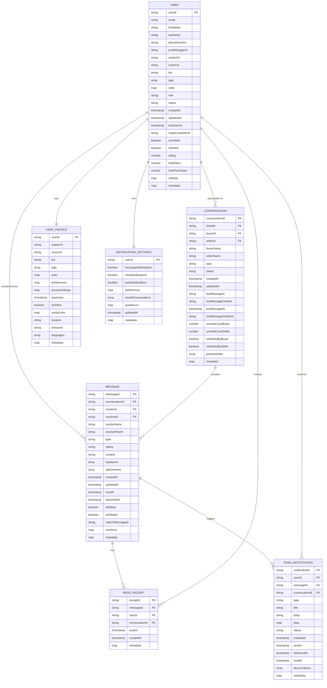

# Enhanced Data Model & API Design

## Entity Relationship Diagram (ERD)



## Enhanced Firestore Schema

### 1. Messages Collection - Enhanced
**Collection Path**: `/messages/{messageId}`

```javascript
{
  "id": "string",                    // Auto-generated message ID
  "conversationId": "string",        // Parent conversation ID
  "senderId": "string",              // Message sender ID
  "receiverId": "string",            // Message receiver ID
  "senderName": "string",            // Sender display name
  "receiverName": "string",          // Receiver display name
  "type": "string",                  // Enum: text, image, video, audio, file, system, offer, reminder, location
  "status": "string",                // Enum: sent, delivered, read, failed, deleted
  "content": "string",               // Message content
  "mediaUrls": "array<string>",      // URLs to media files (images, videos, audio)
  "attachments": "array<object>",    // File attachments with metadata
  "createdAt": "timestamp",          // Message creation timestamp
  "updatedAt": "timestamp?",         // Last edit timestamp
  "readAt": "timestamp?",            // Message read timestamp
  "deliveredAt": "timestamp?",       // Message delivered timestamp
  "isEdited": "boolean",             // Edit flag
  "isDeleted": "boolean",            // Soft delete flag
  "replyToMessageId": "string?",     // Reply reference ID
  "reactions": "map<string, array<string>>", // Emoji reactions: {emoji: [userIds]}
  "metadata": "map?",                // Additional metadata (thread info, system data)
  "encryptionKey": "string?",        // End-to-end encryption key
  "priority": "string",              // Enum: low, normal, high, urgent
  "ttl": "number?",                  // Time-to-live in seconds (for disappearing messages)
  "editHistory": "array<object>?"    // Edit history for auditing
}
```

#### Attachments Object Structure:
```javascript
{
  "id": "string",                    // Attachment ID
  "name": "string",                  // Original filename
  "type": "string",                  // MIME type
  "size": "number",                  // File size in bytes
  "url": "string",                   // Storage URL
  "thumbnailUrl": "string?",         // Thumbnail URL for images/videos
  "duration": "number?",             // Duration for audio/video in seconds
  "metadata": "map?"                 // Additional file metadata
}
```

### 2. UserProfile Collection - Enhanced
**Collection Path**: `/userProfiles/{userId}`

```javascript
{
  "userId": "string",                // User ID (matches auth UID)
  "avatarUrl": "string?",            // Profile picture URL
  "coverUrl": "string?",             // Cover/banner image URL
  "bio": "string?",                  // User biography
  "tags": "array<string>",           // User interests/tags
  "stats": {
    "totalMessages": "number",       // Total messages sent
    "totalConversations": "number",  // Total conversations
    "averageResponseTime": "number", // Average response time in minutes
    "rating": "number",              // User rating (0.0-5.0)
    "totalSales": "number",          // Total ticket sales
    "totalPurchases": "number",      // Total ticket purchases
    "joinedAt": "timestamp",         // Account creation date
    "lastActive": "timestamp"        // Last activity timestamp
  },
  "preferences": {
    "language": "string",            // Preferred language
    "timezone": "string",            // User timezone
    "theme": "string",               // UI theme preference
    "autoTranslate": "boolean",      // Auto-translate messages
    "showOnlineStatus": "boolean",   // Show online status to others
    "allowDirectMessages": "boolean" // Allow DMs from non-contacts
  },
  "privacySettings": {
    "profileVisibility": "string",   // Enum: public, friends, private
    "showEmail": "boolean",          // Show email in profile
    "showPhone": "boolean",          // Show phone in profile
    "showLastSeen": "boolean",       // Show last seen timestamp
    "blockList": "array<string>"     // Blocked user IDs
  },
  "socialLinks": {
    "website": "string?",            // Personal website
    "instagram": "string?",          // Instagram handle
    "twitter": "string?",            // Twitter handle
    "linkedin": "string?"            // LinkedIn profile
  },
  "location": "string?",             // User location (city, country)
  "isOnline": "boolean",             // Current online status
  "lastSeenAt": "timestamp",         // Last seen timestamp
  "deviceTokens": "array<string>",   // FCM device tokens for push notifications
  "metadata": "map?"                 // Additional user metadata
}
```

### 3. ReadReceipts Collection - New
**Collection Path**: `/readReceipts/{receiptId}`

```javascript
{
  "receiptId": "string",             // Auto-generated receipt ID
  "messageId": "string",             // Reference to message
  "userId": "string",                // User who read the message
  "conversationId": "string",        // Parent conversation
  "readAt": "timestamp",             // When message was read
  "createdAt": "timestamp",          // Receipt creation time
  "metadata": "map?"                 // Additional metadata
}
```

### 4. PushNotifications Collection - New
**Collection Path**: `/pushNotifications/{notificationId}`

```javascript
{
  "notificationId": "string",        // Auto-generated notification ID
  "userId": "string",                // Target user ID
  "messageId": "string?",            // Related message ID
  "conversationId": "string?",       // Related conversation ID
  "type": "string",                  // Enum: message, mention, reaction, system
  "title": "string",                 // Notification title
  "body": "string",                  // Notification body
  "data": {
    "conversationId": "string",      // Deep link data
    "messageId": "string",           // Deep link data
    "senderId": "string",            // Sender information
    "senderName": "string",          // Sender name
    "action": "string",              // Action type
    "priority": "string"             // Notification priority
  },
  "status": "string",                // Enum: pending, sent, delivered, failed
  "createdAt": "timestamp",          // Notification creation time
  "sentAt": "timestamp?",            // When notification was sent
  "deliveredAt": "timestamp?",       // When notification was delivered
  "readAt": "timestamp?",            // When notification was read
  "deviceTokens": "array<string>",   // Target device tokens
  "metadata": "map?"                 // Additional metadata
}
```

### 5. NotificationSettings Collection - New
**Collection Path**: `/notificationSettings/{userId}`

```javascript
{
  "userId": "string",                // User ID
  "messageNotifications": "boolean", // Enable message notifications
  "emailNotifications": "boolean",   // Enable email notifications
  "pushNotifications": "boolean",    // Enable push notifications
  "preferences": {
    "sound": "string",               // Notification sound
    "vibration": "boolean",          // Vibration setting
    "showPreview": "boolean",        // Show message content in notification
    "groupNotifications": "boolean", // Group similar notifications
    "quietHours": {
      "enabled": "boolean",          // Enable quiet hours
      "startTime": "string",         // Start time (HH:MM)
      "endTime": "string",           // End time (HH:MM)
      "timezone": "string"           // Timezone
    }
  },
  "mutedConversations": "array<string>", // Muted conversation IDs
  "mutedUsers": "array<string>",     // Muted user IDs
  "updatedAt": "timestamp",          // Last update time
  "metadata": "map?"                 // Additional settings
}
```

## Enhanced API Design

### REST API Endpoints

#### 1. Messages API

```yaml
# Get messages with pagination
GET /api/v1/conversations/{conversationId}/messages
Parameters:
  - limit: integer (default: 20, max: 100)
  - cursor: string (pagination cursor)
  - direction: string (before|after, default: before)
  - includeDeleted: boolean (default: false)
Headers:
  - Authorization: Bearer {token}
Response:
  - messages: array<Message>
  - pagination: PaginationInfo
  - hasMore: boolean
  - nextCursor: string
  - prevCursor: string

# Send message
POST /api/v1/conversations/{conversationId}/messages
Headers:
  - Authorization: Bearer {token}
  - Content-Type: application/json
Body:
  - content: string
  - type: string (text|image|video|audio|file)
  - mediaUrls: array<string>
  - attachments: array<Attachment>
  - replyToMessageId: string (optional)
  - priority: string (optional)
  - ttl: number (optional)
Response:
  - message: Message
  - readReceipt: ReadReceipt

# Mark message as read
PUT /api/v1/messages/{messageId}/read
Headers:
  - Authorization: Bearer {token}
Response:
  - readReceipt: ReadReceipt
  - success: boolean

# Get message read receipts
GET /api/v1/messages/{messageId}/receipts
Headers:
  - Authorization: Bearer {token}
Response:
  - receipts: array<ReadReceipt>
  - totalReads: number

# React to message
POST /api/v1/messages/{messageId}/reactions
Headers:
  - Authorization: Bearer {token}
Body:
  - emoji: string
  - action: string (add|remove)
Response:
  - reactions: map<string, array<string>>
  - success: boolean
```

#### 2. User Profile API

```yaml
# Get user profile
GET /api/v1/users/{userId}/profile
Headers:
  - Authorization: Bearer {token}
Response:
  - profile: UserProfile
  - isOwner: boolean

# Update user profile
PUT /api/v1/users/{userId}/profile
Headers:
  - Authorization: Bearer {token}
  - Content-Type: application/json
Body:
  - avatarUrl: string
  - coverUrl: string
  - bio: string
  - tags: array<string>
  - preferences: object
  - privacySettings: object
  - socialLinks: object
  - location: string
Response:
  - profile: UserProfile
  - success: boolean

# Get user statistics
GET /api/v1/users/{userId}/stats
Headers:
  - Authorization: Bearer {token}
Response:
  - stats: UserStats
  - period: string (daily|weekly|monthly|yearly)
```

#### 3. Push Notifications API

```yaml
# Get notification settings
GET /api/v1/users/{userId}/notifications/settings
Headers:
  - Authorization: Bearer {token}
Response:
  - settings: NotificationSettings

# Update notification settings
PUT /api/v1/users/{userId}/notifications/settings
Headers:
  - Authorization: Bearer {token}
Body:
  - messageNotifications: boolean
  - emailNotifications: boolean
  - pushNotifications: boolean
  - preferences: object
  - mutedConversations: array<string>
Response:
  - settings: NotificationSettings
  - success: boolean

# Register device token
POST /api/v1/users/{userId}/devices
Headers:
  - Authorization: Bearer {token}
Body:
  - token: string
  - platform: string (ios|android|web)
  - deviceId: string
Response:
  - success: boolean
  - deviceId: string

# Get notification history
GET /api/v1/users/{userId}/notifications
Parameters:
  - limit: integer (default: 20)
  - cursor: string
  - type: string (optional filter)
  - status: string (optional filter)
Headers:
  - Authorization: Bearer {token}
Response:
  - notifications: array<PushNotification>
  - pagination: PaginationInfo
  - hasMore: boolean
```

### GraphQL Schema

```graphql
type Message {
  id: ID!
  conversationId: ID!
  senderId: ID!
  receiverId: ID!
  senderName: String!
  receiverName: String!
  type: MessageType!
  status: MessageStatus!
  content: String!
  mediaUrls: [String!]!
  attachments: [Attachment!]!
  createdAt: DateTime!
  updatedAt: DateTime
  readAt: DateTime
  deliveredAt: DateTime
  isEdited: Boolean!
  isDeleted: Boolean!
  replyToMessageId: ID
  reactions: [Reaction!]!
  metadata: JSON
  sender: User!
  receiver: User!
  conversation: Conversation!
  readReceipts: [ReadReceipt!]!
}

type UserProfile {
  userId: ID!
  avatarUrl: String
  coverUrl: String
  bio: String
  tags: [String!]!
  stats: UserStats!
  preferences: UserPreferences!
  privacySettings: PrivacySettings!
  socialLinks: SocialLinks!
  location: String
  isOnline: Boolean!
  lastSeenAt: DateTime!
  metadata: JSON
  user: User!
}

type ReadReceipt {
  receiptId: ID!
  messageId: ID!
  userId: ID!
  conversationId: ID!
  readAt: DateTime!
  createdAt: DateTime!
  metadata: JSON
  user: User!
  message: Message!
}

type PushNotification {
  notificationId: ID!
  userId: ID!
  messageId: ID
  conversationId: ID
  type: NotificationType!
  title: String!
  body: String!
  data: JSON!
  status: NotificationStatus!
  createdAt: DateTime!
  sentAt: DateTime
  deliveredAt: DateTime
  readAt: DateTime
  deviceTokens: [String!]!
  metadata: JSON
  user: User!
}

type NotificationSettings {
  userId: ID!
  messageNotifications: Boolean!
  emailNotifications: Boolean!
  pushNotifications: Boolean!
  preferences: NotificationPreferences!
  mutedConversations: [ID!]!
  mutedUsers: [ID!]!
  updatedAt: DateTime!
  metadata: JSON
}

# Pagination Types
type MessageConnection {
  edges: [MessageEdge!]!
  pageInfo: PageInfo!
  totalCount: Int!
}

type MessageEdge {
  node: Message!
  cursor: String!
}

type PageInfo {
  hasNextPage: Boolean!
  hasPreviousPage: Boolean!
  startCursor: String
  endCursor: String
}

# Enums
enum MessageType {
  TEXT
  IMAGE
  VIDEO
  AUDIO
  FILE
  SYSTEM
  OFFER
  REMINDER
  LOCATION
}

enum MessageStatus {
  SENT
  DELIVERED
  READ
  FAILED
  DELETED
}

enum NotificationType {
  MESSAGE
  MENTION
  REACTION
  SYSTEM
}

enum NotificationStatus {
  PENDING
  SENT
  DELIVERED
  FAILED
}

# Queries
type Query {
  # Messages
  messages(
    conversationId: ID!
    first: Int
    after: String
    last: Int
    before: String
    includeDeleted: Boolean = false
  ): MessageConnection!
  
  message(id: ID!): Message
  
  # User Profiles
  userProfile(userId: ID!): UserProfile
  
  # Read Receipts
  messageReadReceipts(messageId: ID!): [ReadReceipt!]!
  
  # Notifications
  notifications(
    userId: ID!
    first: Int
    after: String
    type: NotificationType
    status: NotificationStatus
  ): NotificationConnection!
  
  notificationSettings(userId: ID!): NotificationSettings
}

# Mutations
type Mutation {
  # Messages
  sendMessage(input: SendMessageInput!): SendMessagePayload!
  markMessageAsRead(messageId: ID!): ReadReceipt!
  reactToMessage(input: ReactToMessageInput!): Message!
  editMessage(input: EditMessageInput!): Message!
  deleteMessage(messageId: ID!): Boolean!
  
  # User Profiles
  updateUserProfile(input: UpdateUserProfileInput!): UserProfile!
  
  # Notifications
  updateNotificationSettings(input: UpdateNotificationSettingsInput!): NotificationSettings!
  registerDeviceToken(input: RegisterDeviceTokenInput!): Boolean!
  markNotificationAsRead(notificationId: ID!): PushNotification!
}

# Subscriptions
type Subscription {
  messageAdded(conversationId: ID!): Message!
  messageUpdated(conversationId: ID!): Message!
  messageDeleted(conversationId: ID!): ID!
  messageReadReceiptAdded(conversationId: ID!): ReadReceipt!
  userOnlineStatusChanged(userId: ID!): User!
  notificationReceived(userId: ID!): PushNotification!
}
```

## Pagination Strategy

### Cursor-based Pagination
```javascript
// Request
{
  "limit": 20,
  "cursor": "eyJjcmVhdGVkQXQiOiIyMDI0LTEyLTI4VDA5OjMwOjAwWiIsImlkIjoibXNnXzEyMyJ9",
  "direction": "before" // or "after"
}

// Response
{
  "messages": [...],
  "pagination": {
    "hasMore": true,
    "nextCursor": "eyJjcmVhdGVkQXQiOiIyMDI0LTEyLTI4VDA5OjAwOjAwWiIsImlkIjoibXNnXzEwMCJ9",
    "prevCursor": "eyJjcmVhdGVkQXQiOiIyMDI0LTEyLTI4VDEwOjAwOjAwWiIsImlkIjoibXNnXzE0NiJ9",
    "totalCount": 1250
  }
}
```

### Infinite Scroll Implementation
```javascript
// Client-side implementation
class MessagePagination {
  constructor(conversationId) {
    this.conversationId = conversationId;
    this.messages = [];
    this.cursors = {
      next: null,
      prev: null
    };
    this.hasMore = true;
  }

  async loadMore() {
    if (!this.hasMore) return;
    
    const response = await fetch(`/api/v1/conversations/${this.conversationId}/messages`, {
      method: 'GET',
      headers: {
        'Authorization': `Bearer ${token}`,
        'Content-Type': 'application/json'
      },
      params: {
        limit: 20,
        cursor: this.cursors.next,
        direction: 'before'
      }
    });
    
    const data = await response.json();
    this.messages.push(...data.messages);
    this.cursors.next = data.pagination.nextCursor;
    this.hasMore = data.pagination.hasMore;
  }

  async loadNewer() {
    if (!this.cursors.prev) return;
    
    const response = await fetch(`/api/v1/conversations/${this.conversationId}/messages`, {
      method: 'GET',
      headers: {
        'Authorization': `Bearer ${token}`,
        'Content-Type': 'application/json'
      },
      params: {
        limit: 20,
        cursor: this.cursors.prev,
        direction: 'after'
      }
    });
    
    const data = await response.json();
    this.messages.unshift(...data.messages);
    this.cursors.prev = data.pagination.prevCursor;
  }
}
```

## Read Receipts Implementation

### Real-time Read Receipts
```javascript
// When message is read
async function markMessageAsRead(messageId, userId) {
  const readReceipt = {
    receiptId: generateId(),
    messageId,
    userId,
    conversationId,
    readAt: new Date(),
    createdAt: new Date()
  };
  
  // Store in Firestore
  await db.collection('readReceipts').doc(readReceipt.receiptId).set(readReceipt);
  
  // Update message status
  await db.collection('messages').doc(messageId).update({
    status: 'read',
    readAt: readReceipt.readAt
  });
  
  // Real-time update via WebSocket
  await publishToChannel(`conversation:${conversationId}`, {
    type: 'READ_RECEIPT',
    data: readReceipt
  });
  
  return readReceipt;
}

// Client-side read receipt handling
socket.on('READ_RECEIPT', (data) => {
  const { messageId, userId, readAt } = data;
  updateMessageReadStatus(messageId, userId, readAt);
  showReadIndicator(messageId, userId);
});
```

### Read Receipt Aggregation
```javascript
// Get read receipts for a message
async function getMessageReadReceipts(messageId) {
  const receipts = await db
    .collection('readReceipts')
    .where('messageId', '==', messageId)
    .orderBy('readAt', 'desc')
    .get();
  
  return receipts.docs.map(doc => ({
    id: doc.id,
    ...doc.data(),
    user: await getUserProfile(doc.data().userId)
  }));
}

// Batch read receipts for conversation
async function getConversationReadReceipts(conversationId, messageIds) {
  const receipts = await db
    .collection('readReceipts')
    .where('conversationId', '==', conversationId)
    .where('messageId', 'in', messageIds)
    .get();
  
  return receipts.docs.reduce((acc, doc) => {
    const data = doc.data();
    if (!acc[data.messageId]) acc[data.messageId] = [];
    acc[data.messageId].push(data);
    return acc;
  }, {});
}
```

## Push Notification Payloads

### Firebase Cloud Messaging (FCM) Payload Structure

#### Message Notification
```javascript
{
  "notification": {
    "title": "New message from John Doe",
    "body": "Hey! Are you still selling the concert tickets?",
    "icon": "https://stubstreet.com/icons/message.png",
    "click_action": "OPEN_CONVERSATION",
    "sound": "default",
    "badge": "1"
  },
  "data": {
    "type": "message",
    "conversationId": "conv_123",
    "messageId": "msg_456",
    "senderId": "user_789",
    "senderName": "John Doe",
    "senderAvatar": "https://stubstreet.com/avatars/user_789.jpg",
    "priority": "high",
    "action": "open_conversation",
    "timestamp": "2024-12-28T10:30:00Z"
  },
  "android": {
    "notification": {
      "channel_id": "messages",
      "color": "#FF6B35",
      "small_icon": "ic_message",
      "large_icon": "https://stubstreet.com/avatars/user_789.jpg"
    },
    "data": {
      "click_action": "OPEN_CONVERSATION"
    }
  },
  "apns": {
    "payload": {
      "aps": {
        "alert": {
          "title": "New message from John Doe",
          "body": "Hey! Are you still selling the concert tickets?"
        },
        "sound": "default",
        "badge": 1,
        "category": "MESSAGE_CATEGORY"
      }
    }
  },
  "webpush": {
    "notification": {
      "title": "New message from John Doe",
      "body": "Hey! Are you still selling the concert tickets?",
      "icon": "https://stubstreet.com/icons/message.png",
      "badge": "https://stubstreet.com/icons/badge.png",
      "image": "https://stubstreet.com/avatars/user_789.jpg",
      "actions": [
        {
          "action": "reply",
          "title": "Reply",
          "icon": "https://stubstreet.com/icons/reply.png"
        },
        {
          "action": "view",
          "title": "View",
          "icon": "https://stubstreet.com/icons/view.png"
        }
      ]
    },
    "data": {
      "conversationId": "conv_123",
      "messageId": "msg_456"
    }
  }
}
```

#### Reaction Notification
```javascript
{
  "notification": {
    "title": "John Doe reacted to your message",
    "body": "👍 to \"The tickets are still available\"",
    "icon": "https://stubstreet.com/icons/reaction.png"
  },
  "data": {
    "type": "reaction",
    "conversationId": "conv_123",
    "messageId": "msg_456",
    "userId": "user_789",
    "userName": "John Doe",
    "emoji": "👍",
    "action": "open_message"
  }
}
```

#### System Notification
```javascript
{
  "notification": {
    "title": "Payment Received",
    "body": "You received payment for Taylor Swift concert tickets",
    "icon": "https://stubstreet.com/icons/payment.png"
  },
  "data": {
    "type": "system",
    "subtype": "payment_received",
    "orderId": "order_123",
    "amount": "150.00",
    "currency": "USD",
    "action": "open_order"
  }
}
```

### Notification Service Implementation

```javascript
class NotificationService {
  constructor(fcmAdmin) {
    this.fcm = fcmAdmin;
  }

  async sendMessageNotification(message, recipients) {
    const payload = {
      notification: {
        title: `New message from ${message.senderName}`,
        body: this.truncateMessage(message.content),
        icon: '/icons/message.png'
      },
      data: {
        type: 'message',
        conversationId: message.conversationId,
        messageId: message.id,
        senderId: message.senderId,
        senderName: message.senderName,
        timestamp: message.createdAt.toISOString()
      }
    };

    return await this.sendToUsers(recipients, payload);
  }

  async sendReactionNotification(reaction, message, recipient) {
    const payload = {
      notification: {
        title: `${reaction.userName} reacted to your message`,
        body: `${reaction.emoji} to "${this.truncateMessage(message.content)}"`,
        icon: '/icons/reaction.png'
      },
      data: {
        type: 'reaction',
        conversationId: message.conversationId,
        messageId: message.id,
        userId: reaction.userId,
        userName: reaction.userName,
        emoji: reaction.emoji
      }
    };

    return await this.sendToUser(recipient, payload);
  }

  async sendToUsers(userIds, payload) {
    const results = [];
    
    for (const userId of userIds) {
      const tokens = await this.getUserDeviceTokens(userId);
      const settings = await this.getNotificationSettings(userId);
      
      if (settings.pushNotifications && tokens.length > 0) {
        const result = await this.fcm.sendMulticast({
          tokens: tokens,
          ...payload
        });
        results.push({ userId, result });
      }
    }
    
    return results;
  }

  async getUserDeviceTokens(userId) {
    const profile = await db
      .collection('userProfiles')
      .doc(userId)
      .get();
    
    return profile.data()?.deviceTokens || [];
  }

  async getNotificationSettings(userId) {
    const settings = await db
      .collection('notificationSettings')
      .doc(userId)
      .get();
    
    return settings.data() || { pushNotifications: true };
  }

  truncateMessage(content, maxLength = 100) {
    return content.length > maxLength 
      ? content.substring(0, maxLength) + '...'
      : content;
  }
}
```

## Firestore Indexes

```javascript
// Required indexes for efficient queries
const indexes = [
  // Messages collection
  {
    collectionGroup: 'messages',
    fields: [
      { fieldPath: 'conversationId', order: 'ASCENDING' },
      { fieldPath: 'createdAt', order: 'ASCENDING' }
    ]
  },
  {
    collectionGroup: 'messages',
    fields: [
      { fieldPath: 'conversationId', order: 'ASCENDING' },
      { fieldPath: 'createdAt', order: 'DESCENDING' }
    ]
  },
  {
    collectionGroup: 'messages',
    fields: [
      { fieldPath: 'senderId', order: 'ASCENDING' },
      { fieldPath: 'createdAt', order: 'DESCENDING' }
    ]
  },
  {
    collectionGroup: 'messages',
    fields: [
      { fieldPath: 'status', order: 'ASCENDING' },
      { fieldPath: 'createdAt', order: 'DESCENDING' }
    ]
  },
  
  // ReadReceipts collection
  {
    collectionGroup: 'readReceipts',
    fields: [
      { fieldPath: 'messageId', order: 'ASCENDING' },
      { fieldPath: 'readAt', order: 'DESCENDING' }
    ]
  },
  {
    collectionGroup: 'readReceipts',
    fields: [
      { fieldPath: 'conversationId', order: 'ASCENDING' },
      { fieldPath: 'readAt', order: 'DESCENDING' }
    ]
  },
  {
    collectionGroup: 'readReceipts',
    fields: [
      { fieldPath: 'userId', order: 'ASCENDING' },
      { fieldPath: 'readAt', order: 'DESCENDING' }
    ]
  },
  
  // PushNotifications collection
  {
    collectionGroup: 'pushNotifications',
    fields: [
      { fieldPath: 'userId', order: 'ASCENDING' },
      { fieldPath: 'createdAt', order: 'DESCENDING' }
    ]
  },
  {
    collectionGroup: 'pushNotifications',
    fields: [
      { fieldPath: 'userId', order: 'ASCENDING' },
      { fieldPath: 'status', order: 'ASCENDING' },
      { fieldPath: 'createdAt', order: 'DESCENDING' }
    ]
  },
  {
    collectionGroup: 'pushNotifications',
    fields: [
      { fieldPath: 'conversationId', order: 'ASCENDING' },
      { fieldPath: 'createdAt', order: 'DESCENDING' }
    ]
  },
  
  // UserProfiles collection
  {
    collectionGroup: 'userProfiles',
    fields: [
      { fieldPath: 'isOnline', order: 'ASCENDING' },
      { fieldPath: 'lastSeenAt', order: 'DESCENDING' }
    ]
  }
];
```

## Security Rules Updates

```javascript
rules_version = '2';
service cloud.firestore {
  match /databases/{database}/documents {
    
    // Messages collection
    match /messages/{messageId} {
      allow read, write: if request.auth != null && 
        (request.auth.uid == resource.data.senderId || 
         request.auth.uid == resource.data.receiverId);
      
      allow create: if request.auth != null && 
        request.auth.uid == request.resource.data.senderId &&
        validateMessageData(request.resource.data);
      
      allow update: if request.auth != null && 
        request.auth.uid == resource.data.senderId &&
        validateMessageUpdate(request.resource.data, resource.data);
    }
    
    // UserProfiles collection
    match /userProfiles/{userId} {
      allow read: if request.auth != null && 
        (request.auth.uid == userId || 
         resource.data.privacySettings.profileVisibility == 'public');
      
      allow write: if request.auth != null && 
        request.auth.uid == userId &&
        validateProfileData(request.resource.data);
    }
    
    // ReadReceipts collection
    match /readReceipts/{receiptId} {
      allow read: if request.auth != null && 
        (request.auth.uid == resource.data.userId ||
         isConversationParticipant(resource.data.conversationId));
      
      allow create: if request.auth != null && 
        request.auth.uid == request.resource.data.userId &&
        validateReadReceiptData(request.resource.data);
    }
    
    // PushNotifications collection
    match /pushNotifications/{notificationId} {
      allow read: if request.auth != null && 
        request.auth.uid == resource.data.userId;
      
      allow write: if false; // Only server can write
    }
    
    // NotificationSettings collection
    match /notificationSettings/{userId} {
      allow read, write: if request.auth != null && 
        request.auth.uid == userId;
    }
    
    // Helper functions
    function validateMessageData(data) {
      return data.keys().hasAll(['conversationId', 'senderId', 'receiverId', 'content', 'type']) &&
             data.content is string &&
             data.content.size() <= 10000 &&
             data.type in ['text', 'image', 'video', 'audio', 'file', 'system'];
    }
    
    function validateMessageUpdate(newData, oldData) {
      return newData.senderId == oldData.senderId &&
             newData.conversationId == oldData.conversationId &&
             newData.receiverId == oldData.receiverId;
    }
    
    function validateProfileData(data) {
      return data.userId == request.auth.uid &&
             (data.bio == null || data.bio.size() <= 500) &&
             (data.tags == null || data.tags.size() <= 20);
    }
    
    function validateReadReceiptData(data) {
      return data.userId == request.auth.uid &&
             data.readAt is timestamp &&
             data.messageId is string;
    }
    
    function isConversationParticipant(conversationId) {
      return exists(/databases/$(database)/documents/conversations/$(conversationId)) &&
             (get(/databases/$(database)/documents/conversations/$(conversationId)).data.buyerId == request.auth.uid ||
              get(/databases/$(database)/documents/conversations/$(conversationId)).data.sellerId == request.auth.uid);
    }
  }
}
```

This comprehensive design provides:

1. **Enhanced Data Model**: Updated schema with proper message and user profile structures
2. **Efficient Pagination**: Cursor-based pagination for large datasets
3. **Real-time Read Receipts**: Tracking message read status with timestamps
4. **Push Notification System**: Complete FCM integration with rich payloads
5. **REST and GraphQL APIs**: Full API coverage with proper endpoints
6. **Security Rules**: Comprehensive Firestore security rules
7. **Performance Optimization**: Proper indexing strategy for efficient queries
8. **Real-time Features**: WebSocket/subscription support for live updates
